> tag: [[rust]]

best gene is `YYYYGG` 4 yield 2 grow OR
best gene is `YYYYYG` 5 yield 1 grow
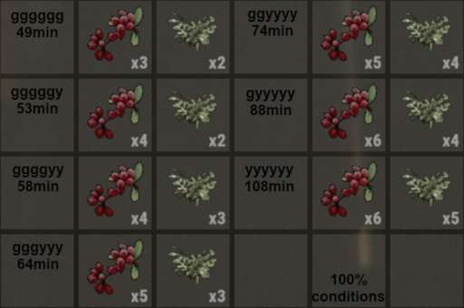

https://wgn.si/genetics/
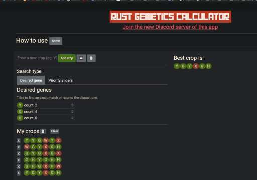

or this
https://www.rustbreeder.com/


- `Berry` need water `4300-7250` ml
  - auto water = 15/20 sec
- `Pumpkin` need water `4500-6800` ml
  - auto water = 45/48 sec

# prevent crossbreed

ใช้ชนิดพืชต่างกัน วางตามสี
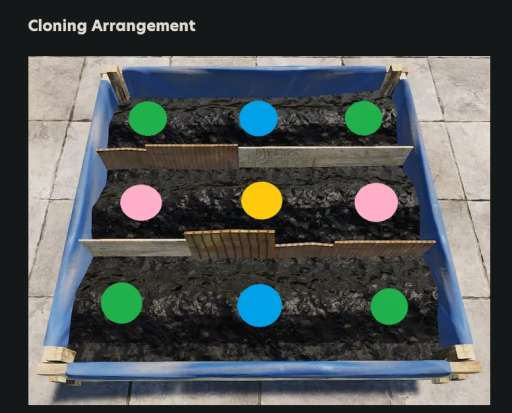

Best `gene guide`
https://youtu.be/XDY14Y-3oVA?t=929

- ปกติปลูกมุม 4 มุมนี้ กันมันปนกันมั่ว
  

# เมื่อต้องการปรับพันธ์พืช

- ให้เอาอันอะไรก็ได้ ไว้ตรงกลางก่อน ประมาณ 10 นาที
- 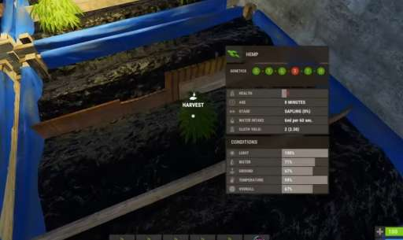
- จากนั้นค่อยเอาพันธ์ดีมาล้อมรอบๆ
- พอตรงกลางโต มันจะดูด รอบๆเข้ามาพอดีๆ
- 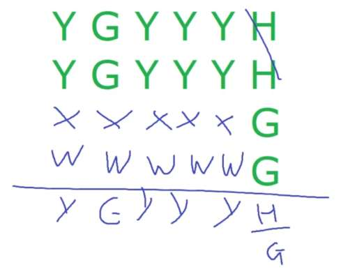
- the 2 plant below `cannot` have any `duplicate`
- 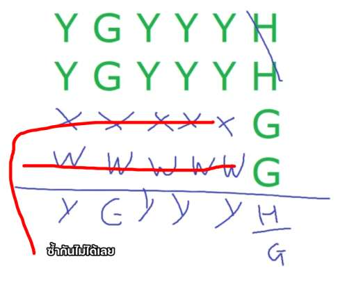

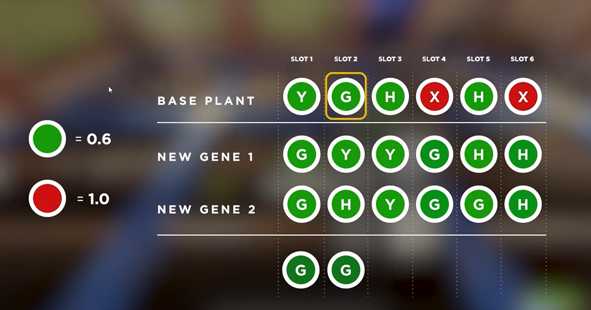

แบบผสมหลายอันพร้อมกัน อีกสูตร


# BEST GUIDE in 2025
### เรื่องการวางน้ำ / ไฟ


1 ไฟ ให้แสงได้ 4 กล่องใหญ่
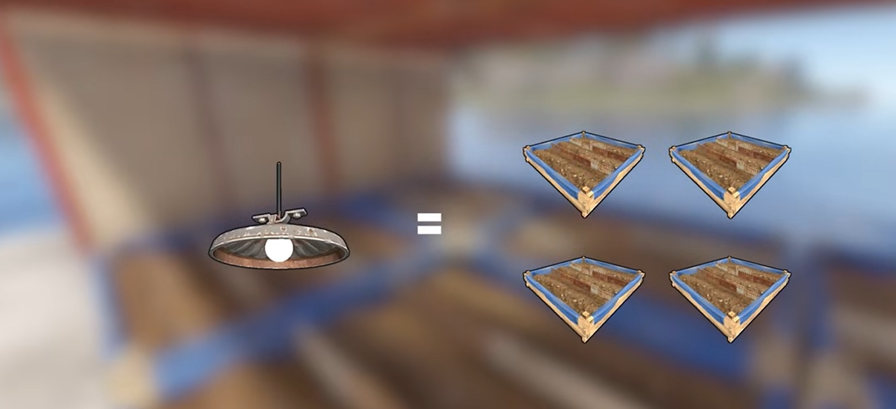

1 sprinkler ให้น้ำสำหรับ 6 กล่อง ดังนั้นถ้าฟาร์มใหญ่ก็ต้อง 1 แปลงต่อ 1 อันไปเลย...
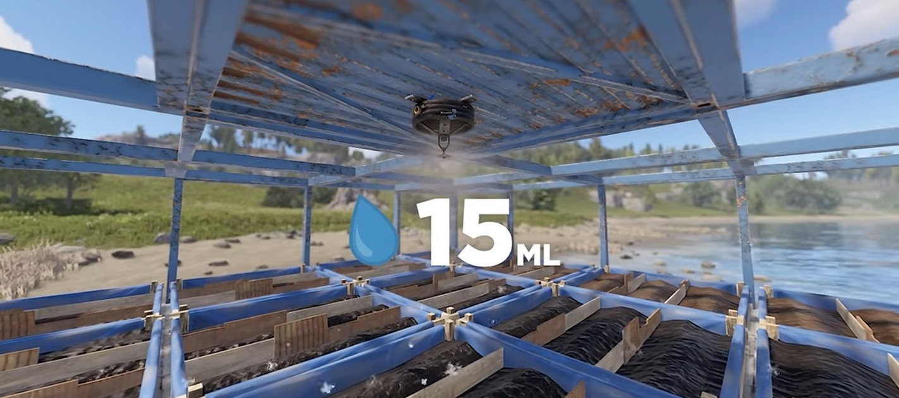

คือ หารด้วยจำนวนแปลง
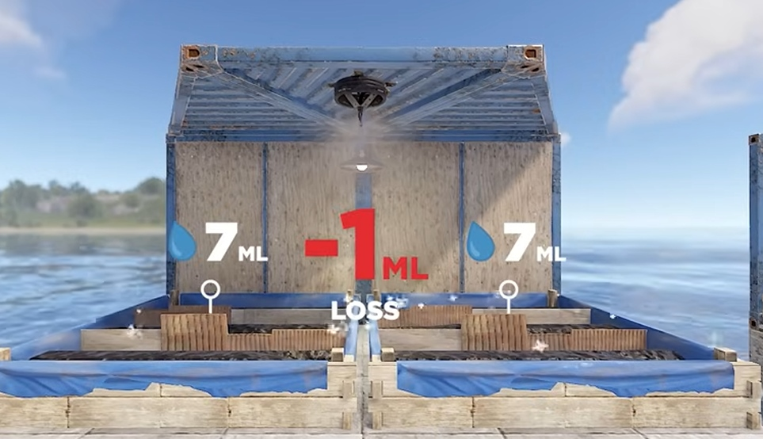
ดังนั้นให้มันโดน 3 แปลง แล้วหาร 3 จะคุ้มสุด
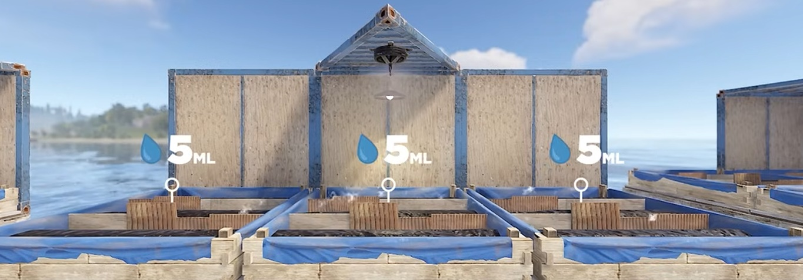

เขาบอก อย่าคิดให้ยาก เอาแบบง่ายๆ 55555 แค่นี้ พอ
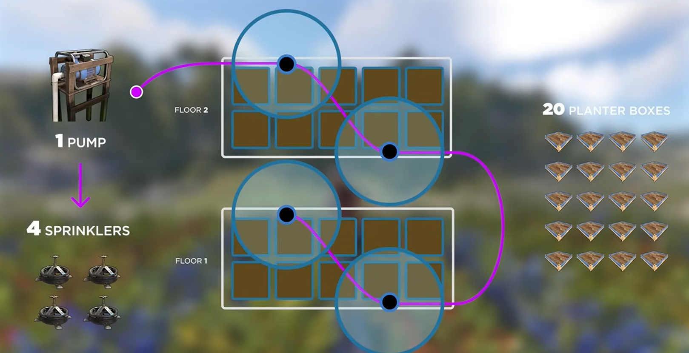

ถ้าเป็นทะเลต้องทำแบบนี้นะ คือ อัน water purifier มันผลิตน้ำได้น้อยกว่ามาก
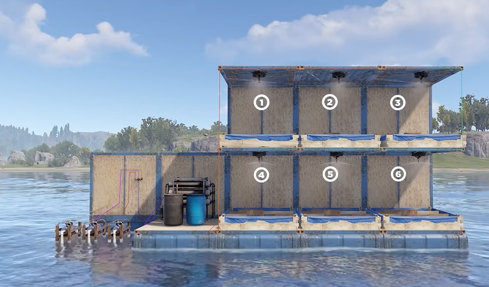

### template ปลูกแบบง่ายๆ คือ
ถ้าเป็น 2x2
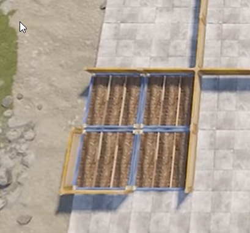


คือมีไฟกลาง และ sprinkler ข้างห้อง จบ

แบบ 2x4
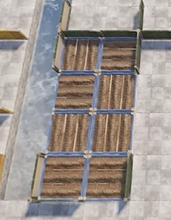

คือ ไฟกลางแปลง 2 ดวง ตรงที่เก็บครบ 4 และ sprinkler อยู่ตรงมุมชิดสุด ตามในรูป 2 ฝั่ง

4x4
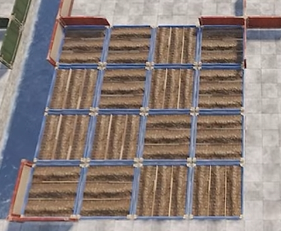

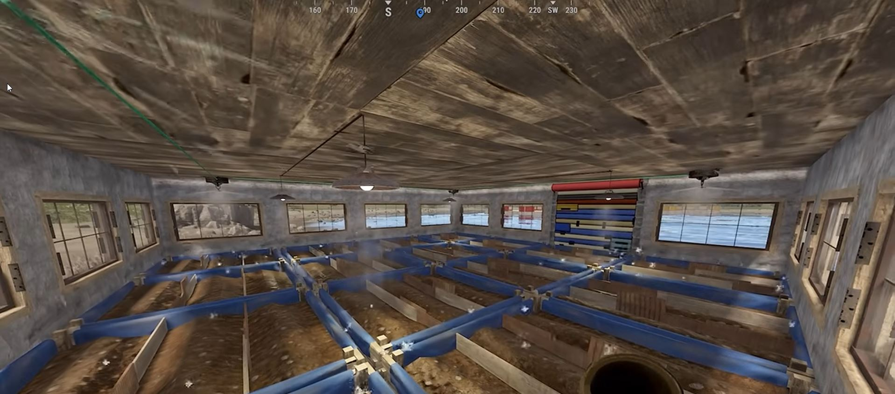
ไฟเหมือนเดิม แต่ว่า sprinkler ให้อยู่กลางของอันริมทุกอัน
เหลืองไฟ ฟ้าน้ำ
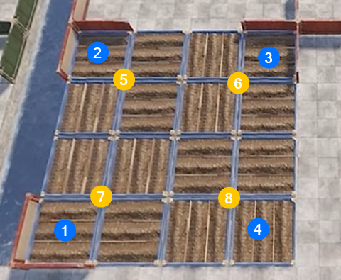


### คำสั่งในเสกยีนดีสุด
ใน server Templar
```
/setgenes YYYGGG
```

อันนี้ดีที่สุด เพราะให้ yield สูงสุด YYY = 5
การมี YYYY ก็ให้ = 5
ดังนั้นเอา GGG มาทำให้โตเร็วจะดีกว่า

แบบ ทุก Y หรือ G ที่มากขึ้น จะทำให้ผลลดลง คือ สมมุติมี 6 Y, 3Y แรกมีผลมาก 3Y หลังไม่ค่อยเพิ่มความต่างละ

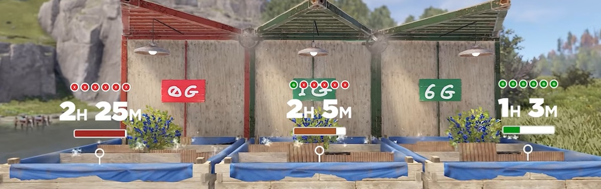

สังเกตุว่า Y / G ตัวแรกที่โผล่มา มีกลเยอะมาก แต่ตัวหลังๆที่ตามมา จะให้ผลน้อยลง

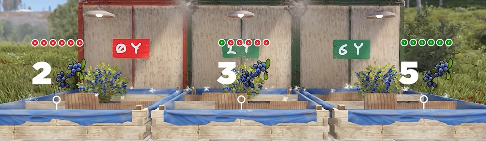

Y มีผลทำให้ได้ clone เยอะขึ้นตอนที่ clone ด้วย

