> tag: [[rust]]
> [Traps & Turrets - Defence & Base Guide | Rust Tutorial - YouTube](https://www.youtube.com/watch?v=kNQljV77PgQ)

# shotgun trap

> [!success] GOOD
>
> - best place = drop down / climb up
> - 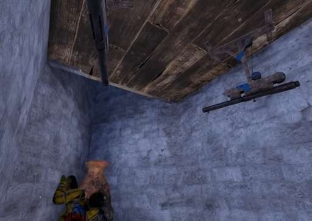
> - 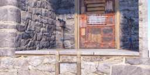
> - 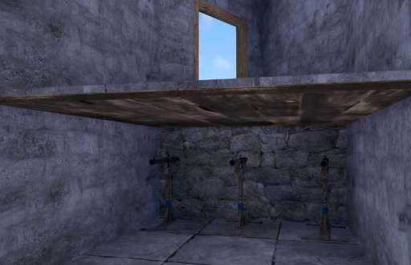

> [!failure] BAD
>
> - if enemy can see it it useless
> - 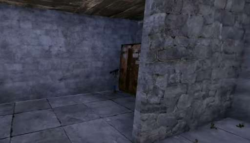
> - ceiling is useless
> - 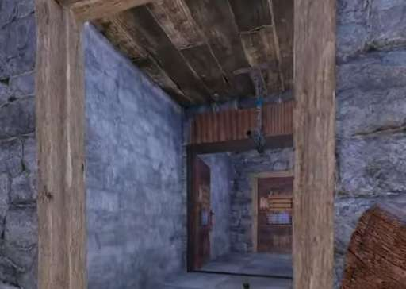

# Flame turret

= is good for important path that raider really need to pass it will greatly slow down raider

# landmine

hide in bush for best
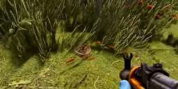

# auto turret

combine above video with this
[Rust - How To PROPERLY Use The Auto Turret (Rust Base Design 2021) - YouTube](https://www.youtube.com/watch?v=AvJ0MHPhpRw)

> [!success] GOOD
> Place it like this
> 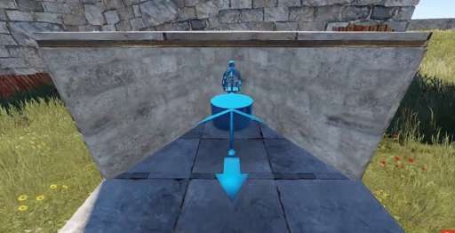 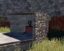
> can also place like this
> 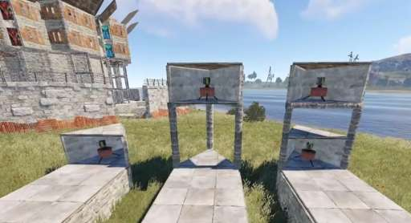
> 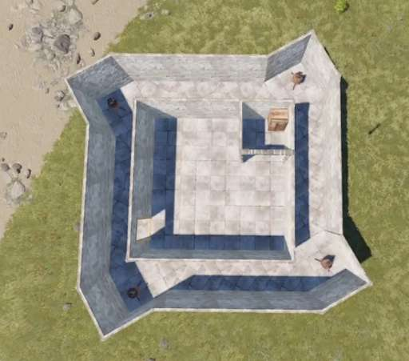
> roof add this cover
> 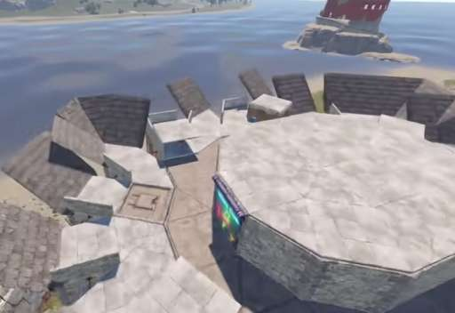

> [!failure] BAD
> this shoot itself
> 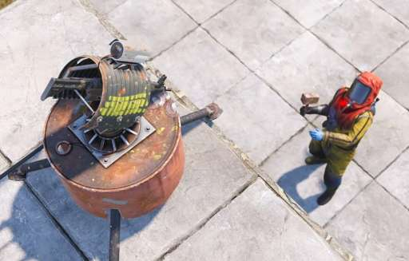
> ROOF BAD because raider can land on red arrow and destroy turret
> 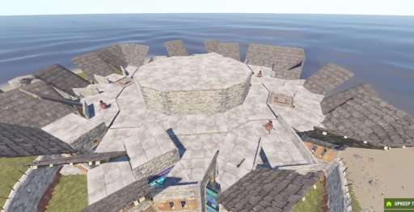
> 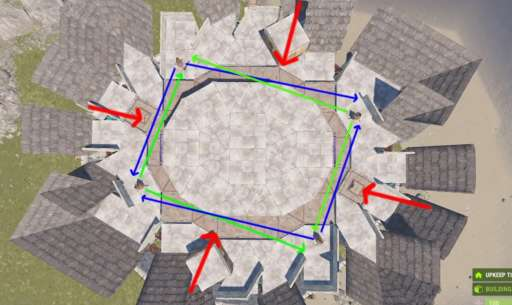
